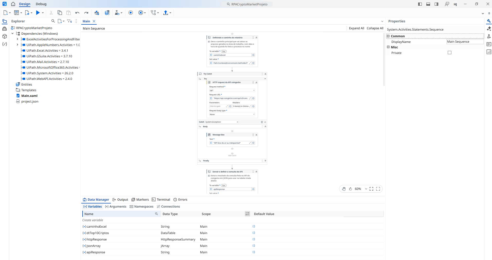
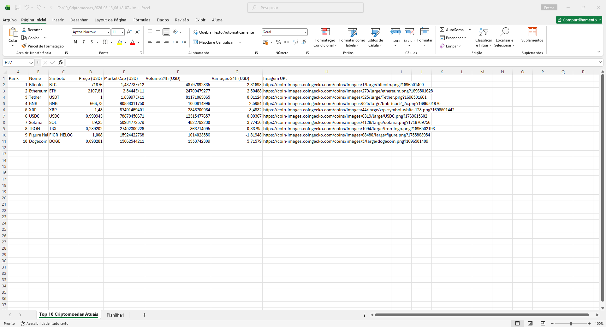

# RPACryptoMarketProjeto

Este projeto de RPA foi desenvolvido usando **UiPath** e a API **CoinGecko** que monitora o mercado de criptomoedas em tempo real.

## Funcionalidades
- Consumo da API **CoinGecko** para obter dados atualizados.
- Filtro automático das **Top 10** moedas por Market Cap.
- Geração de relatório **Excel (.xlsx)** dinâmico com data e hora.

## Tecnologias e Conceitos
- **UiPath Studio** (Arquitetura hibrida Modern/Classic).
- **JSON Deserialization** (Manipulação de Arrays e Objetos).
- **DataTable** (Estruturação de dados em memória).
- **VB.NET** (Tratamento de strings e caminhos de arquivo).

## Como Executar
1. Instale o UiPath Studio.
2. Clone este repositório.
3. Abra o `project.json` e execute o `Main.xaml`.
4. O relatório será gerado automaticamente na sua Área de Trabalho.
5. A base do mesmo pode ser usada para qualquer tipo de consulta de APIs sujeito somente a alterações
   da tabela principal e troca de GET da API.

16/03/2026: Fix tratamento de valores nulos (Null Handling) de IsNot Nothing para .Type <> JTokenType.Null

Contato: Haroldjonathanavila@gmail.com

